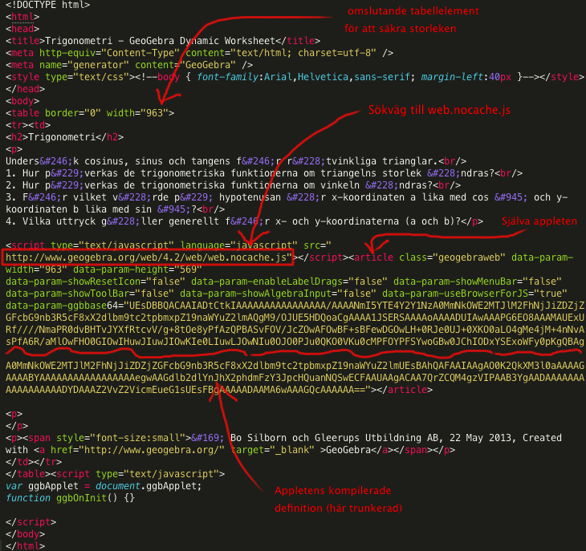

## EXPORTERING

report report report

### HTML5

Yada yada. Primära resurser för undersökningen: 

*    [Wiki på Geogebra](http://wiki.geogebra.org/en/Tutorial:Creating_HTML5_documents_with_GeoGebraWeb)
*    [Devsida](http://dev.geogebra.org/trac/wiki/GeoGebraWeb)

Bla bla. [Ladda ner paketet](http://dev.geogebra.org/download/web/GeoGebraWeb-latest.zip)! "These are not intended for end users"

Tungvikt. 212 filer, 55 megabyte. En översikt över innehållet:

Bla bla. Så, vad returneras? Se här:

För att extrahera en labbmodul ur det exporerade html-dokumentet krävs lite enkel handpåläggning. Själva appleten ryms i article-elementet. Denna är 'självförsörjande', och kan kopieras och integreras i ett annat html-dokument. Enda förutsättningen är att detta html-dokument laddar in filen `web.nocache.js` från GeoGebraWeb.

Nedan syns exempel på källkoden för ett minimalt dokument där två olika labbar exponeras. Exemplet ligger också live [här](http://krawaller.github.com/gleerups/export/applets.html).

<imr src='./bilder/geogebraweb-composite.png' />

### Animerad GIF

Vid inklusion av enklare labbar i en digital kontext så skulle också animerad GIF kunna vara ett exporeringsalternativ. Animationen skapas utifrån en slider, så de labbar som bäst lämpar sig för detta format är de som innehåller (eller kan skrivas om till att innehålla) exakt 1 slider. 

Här är ett exempel där jag manipulerat laborationen om enhetscirkeln så att vinkeln bestäms utifrån en slider, som sedan fått definiera animationen:

Interaktiviteten är förlorad, men laborationen är nu reducerad till en enda .gif-fil som därmed är väldigt lätt att hantera.