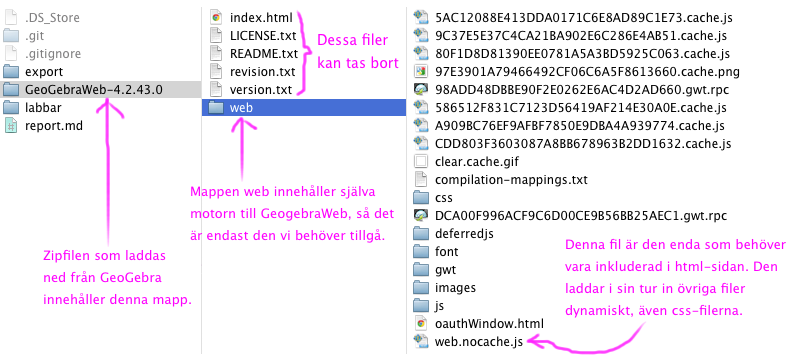
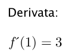
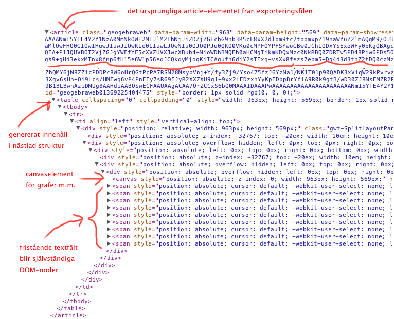
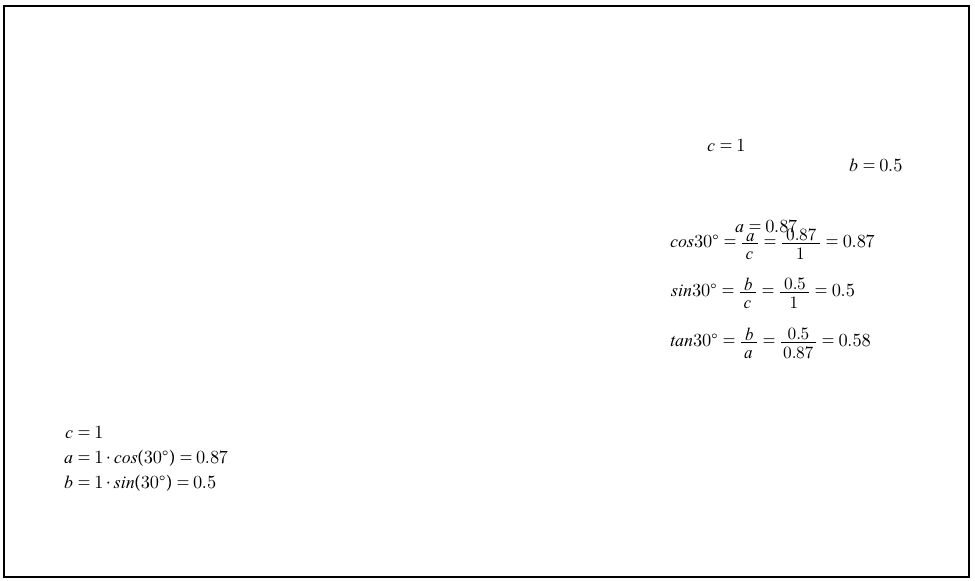
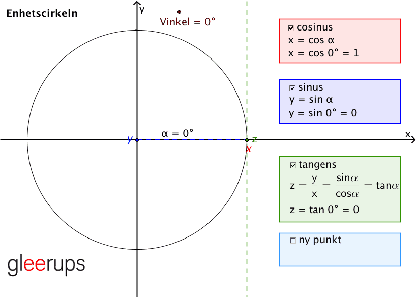

# Utvärdering av GeoGebras HTML-export

Denna rapport undersöker, för Gleerups räkning, nuvarande status på GeoGebras exportfunktionalitet till HTML5. Rapporten är tänkt att tjäna som beslutsunderlag för Gleerups kommande vägskäl angående hur man skall gå vidare med de interaktiva laborationerna i sin webbmiljö - kan man exportera de befintliga laborationerna från GeoGebra, eller behöver man återskapa laborationerna med rena webbtekniker?

## Översikt

**GeoGebra** är ett matematikvisualiseringsverktyg skrivet i **Java**. Filer som skapas i GeoGebra kan antingen öppnas i själva programvaran, eller inkluderas i en HTML-sida som en **Java applet**. Denna teknik används i dagsläget i Gleerups digitala material.

Tekniken har flera nackdelar; framför allt fungerar den inte i webbläsare som inte har tillgång till Java. Detta inkluderar både Android-enheter (trots att operativsystemet är baserat på Java) och iOS-enheter.

För att nå dessa enheter påbörjade GeoGebra projektet **GeoGebra Mobile**. Detta blev sedermera ersatt av nuvarande **GeoGebraWeb**. Projektet innebar att man i programvaran lade till möjlighet att exportera GeoGebrafiler till webbformat, som kan visas i en webbläsare utan inblandning av Java.

Denna exportering är skapad med hjälp av **Google Web Toolkit** (GWT), som är ett ramverk i vilket man kan skriva webbapplikationer med Java. GWT kompilerar sedan Javakoden till JavaScript som läses av webbläsaren. Detta är i sammanhanget viktigt - GeoGebra har alltså inte helt omskapats i JavaScript, utan funktionaliteten är "portad" från Java.

Det är denna exporteringsfunktion, GeoGebraWeb, som undersöks i denna rapport.

## EXPORTERING

report report report

### HTML5

Yada yada. Primära resurser för undersökningen: 

*    [Wiki på Geogebra](http://wiki.geogebra.org/en/Tutorial:Creating_HTML5_documents_with_GeoGebraWeb)
*    [Devsida](http://dev.geogebra.org/trac/wiki/GeoGebraWeb)

Bla bla. [Ladda ner paketet](http://dev.geogebra.org/download/web/GeoGebraWeb-latest.zip)! "These are not intended for end users"

Tungvikt. 212 filer, 55 megabyte. En översikt över innehållet:

Bla bla. Så, vad returneras? Se här:

För att extrahera en labbmodul ur det exporerade html-dokumentet krävs lite enkel handpåläggning. Själva appleten ryms i article-elementet. Denna är 'självförsörjande', och kan kopieras och integreras i ett annat html-dokument. Enda förutsättningen är att detta html-dokument laddar in filen `web.nocache.js` från GeoGebraWeb.

Nedan syns exempel på källkoden för ett minimalt dokument där två olika labbar exponeras. Exemplet ligger också live [här](http://krawaller.github.com/gleerups/export/applets.html).

Notera att i exempelfilen så kan det hända att labbarna initialt är väldigt små, men sedan får sin rätta storlek när innehållet laddats. Detta gör då att övrigt innehåll på sidan förskjuts, vilket kan se oprofessionellt ut. Det är bland annat för att förhindra denna effekt som den ursprungliga exporteringen nästlade article-elementet i en tabell med given storlek, så om man vill säkerställa att ingen förskjutning sker så kan man helt enkelt behålla tabellen från exporteringen.

#### Jämförelse Geogebra-HTML

Trogen! Bla bla bla. Renderingen! Här först GeoGebra:

Samma labb i HTML:

Som synes är HTML-versionen ganska lik, om än inte helt identisk. Exempelvis matematiska uttryck ser lite annorlunda ut, vilket beror på att de i Geogebra renderas internt, medan de i HTML-versionen använder JavaScript-biblioteket [MathQuill](http://www.mathquill.com).

#### Funktionalitet

Väldigt mycket är gjort, men det finns en del saker som fortfarande saknas i GeoGebraWeb. Det handlar dock mest om vyer, vilket förmodligen inte påverkar labbarnas användbarhet.

#### Tillförlitlighet

Funktionaliteten verkar överlag översättas utan problematik till webbformat. Jag är imponerad!

Den enda luckan jag hittat hittills syns i bildjämförelsen ovan. Notera i den första bilden, från Geogebra, att uträkningen för derivatan syns längst upp till höger.

I bilden från HTML-exporten syns bara texten "Derivata:", men själva uträkningen saknas!

Det beror på att Bo har använt ett LaTeX-uttryck som inte stöds av den renderare som HTML-versionen använder, nämligen MathQuill. Bo har skrivit följande:

Funktionen `\acute` som Bo har använt för att få till "prim"-markeringen av derivatan stöds inte av MathQuill. När jag istället ändrar till att skriva in primtecknet direkt:

...så fungerar det även i HTML-exporten. For completion's sake så finns exporten med den "felaktiga" koden [här](http://krawaller.github.com/gleerups/export/321_Symmetrisk_andringskvot_derivata.html), och den fixade exporten [här](http://krawaller.github.com/gleerups/export/321_Symmetrisk_andringskvot_derivata_fixed.html).

Detta med att MathQuill endast stöder en delmängd av den LaTeX-syntax som GeoGebra stöder tror jag är den största faran när labbarna skall exporteras. Nu bör förmodligen varje labb kontrolleras efter export ändå, men jag har satt ihop en liten [testsandlåda](mathquill_sandbox.html) där Bo och hans kumpaner enkelt kan testa om MathQuill kan rendera ett givet LaTeX-uttryck.

Om ingen rendering dyker upp nedanför textfältet, eller om renderingen är felaktig, så betyder det att MathQuill har problem med det givna uttrycket och att LaTeX-koden i GeoGebralabben därmed bör omformuleras. Min gissning är dock att det sällan kommer innebära några problem, då MathQuill ändå innehåller alla grundläggande funktioner. Mest kommer det förmodligen handla om mer eller mindre kosmetiska kodändringar, i stil med den jag fick genomföra för att fixa derivatalaborationen ovan.

#### Beståndsdelar

Låt oss titta närmare på vad som faktiskt genereras inne i article-elementet! Så här ser det ut i en web inspector efter att koden exekverats:

Detta är intressant - vi ser här att den genererade webappen innehåller både ett canvas-element samt fristående DOM-noder. Vad är det då som ritas i canvas-elementet? Följande bildpar ämnar demonstrera detta. Här först en skärmdump från en av de exporterade labbarna:

Nu ännu en skärmdump från samma labb, men där jag programmatiskt har dolt canvas-elementet:

Vi ser att det endast är de fristående texterna som ligger i DOM:en. Allt annat ritas upp i canvas-elementet. Detta är inte bara en teknisk parentes; element som finns i DOM:en kan vi interagera med, stila med CSS-mallar, etc. Men canvas-elementet fungerar i det avseendet precis som en vanlig bild - vi har ingen möjlighet att påverka dess innehåll. 

### Animerad GIF

Vid inklusion av enklare labbar i en digital kontext så skulle också animerad GIF kunna vara ett exporeringsalternativ. Animationen skapas utifrån en slider, så de labbar som bäst lämpar sig för detta format är de som innehåller (eller kan skrivas om till att innehålla) exakt 1 slider. 

Här är ett exempel där jag manipulerat laborationen om enhetscirkeln så att vinkeln bestäms utifrån en slider, som sedan fått definiera animationen:

Interaktiviteten är förlorad, men laborationen är nu reducerad till en enda .gif-fil som därmed är väldigt lätt att hantera. Det bör dock noteras att bildernas storlek inte är trivial; detta exempel är nästan exakt 2MB stort.