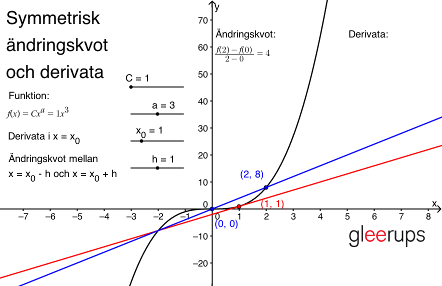
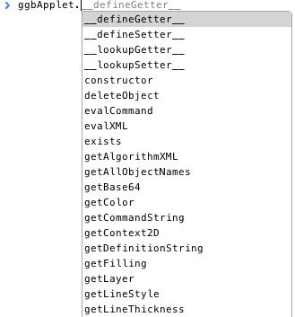
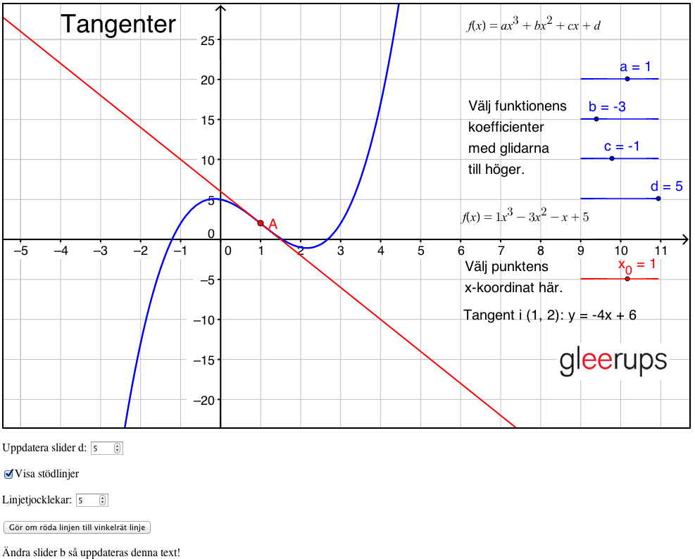
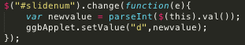
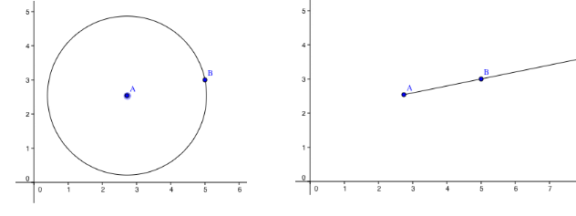
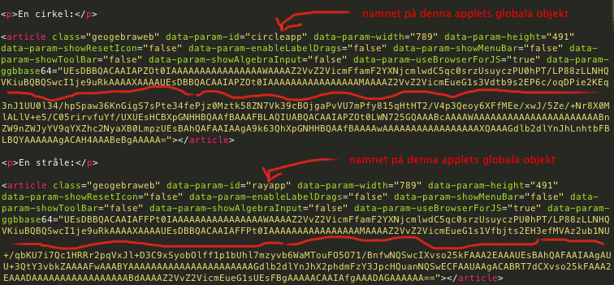
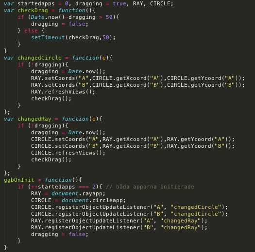

# Utvärdering av GeoGebras HTML-export

Denna rapport undersöker, för Gleerups räkning, nuvarande status på GeoGebras exportfunktionalitet till HTML5. Rapporten är tänkt att tjäna som beslutsunderlag för Gleerups kommande vägskäl angående hur man skall gå vidare med de interaktiva laborationerna i sin webbmiljö - kan man exportera de befintliga laborationerna från GeoGebra, eller behöver man återskapa laborationerna med rena webbtekniker?

## 1 &nbsp;&nbsp;&nbsp; Bakgrund

**GeoGebra** är ett matematikvisualiseringsverktyg skrivet i **Java**. Filer som skapas i GeoGebra kan antingen öppnas i själva programvaran, eller inkluderas i en HTML-sida som en **Java applet**. Denna teknik används i dagsläget i Gleerups digitala material.

Tekniken har flera nackdelar; framför allt fungerar den inte i webbläsare som inte har tillgång till Java. Detta inkluderar både Android-enheter (trots att operativsystemet är baserat på Java) och iOS-enheter.

För att nå dessa enheter påbörjade GeoGebra projektet **GeoGebra Mobile**. Detta blev sedermera ersatt av nuvarande **GeoGebraWeb**. Projektet innebar att man i programvaran lade till möjlighet att exportera GeoGebrafiler till webbformat, som kan visas i en webbläsare utan inblandning av Java.

Denna exportering är skapad med hjälp av **Google Web Toolkit** (GWT), som är ett ramverk i vilket man kan skriva webbapplikationer med Java. GWT kompilerar sedan Javakoden till JavaScript som läses av webbläsaren. Detta är i sammanhanget viktigt - GeoGebra har alltså inte helt omskapats i JavaScript, utan funktionaliteten är "portad" från Java.

Det är denna exporteringsfunktion, GeoGebraWeb, som undersöks i denna rapport. Utgångspunkten, förutom empiriska studier, har varit dokumentationen på [GeoGebraWebs Wiki](http://wiki.geogebra.org/en/Tutorial:Creating_HTML5_documents_with_GeoGebraWeb) samt dess [developersida](http://dev.geogebra.org/trac/wiki/GeoGebraWeb).

## 2 &nbsp;&nbsp;&nbsp; Undersökning

report report report

### 2.1 &nbsp;&nbsp;&nbsp; Närbild av den exporterade html-koden i en applet

Bla bla. Så, vad exporteras egentligen från GeoGebra? Se här:

Resultatet blir alltid en "fullständig" html-fil, med både head- och body-tagg. Denna fil fungerar nu som vad GeoGebra kallar för en **app**, det vill säga ett html-dokument som inte består av något annat än den exporterade GeoGebra filen.

För att åstadkomma ett fristående kodblock ur detta (vad GeoGebra kallar **applet**) som man sedan kan lägga in i ett annat html-dokument krävs lite enkel handpåläggning. Själva appleten ryms i article-elementet. Denna är 'självförsörjande', och kan kopieras och integreras i ett annat html-dokument. Enda förutsättningen är att detta html-dokument laddar in filen `web.nocache.js` från GeoGebraWeb.

Nedan syns exempel på källkoden för ett minimalt dokument där två olika labbar exponeras samtidigt, tillsammans med annat html-innehåll. Exemplet ligger också live [här](http://krawaller.github.com/gleerups/export/applets.html).

Notera att när exempelfilen renderas så kan det hända att labbarna initialt är väldigt små, men sedan får sin rätta storlek när innehållet laddats. Detta gör då att övrigt innehåll på sidan förskjuts, vilket kan se oprofessionellt ut. Det är bland annat för att förhindra denna effekt som den ursprungliga exporteringen nästlade article-elementet i en tabell med given storlek, så om man vill säkerställa att ingen förskjutning sker så kan man helt enkelt behålla tabellen från exporteringen.

### 2.2 &nbsp;&nbsp;&nbsp; Förutsättningar för att köra GeoGebraWeb utan yttre beroenden

Den exporterade appleten hänvisar, som vi såg ovan, till kod på GeoGebras servrar. Hur gör man då för att använda den exporterade koden i offlineläge eller självständigt på egna servrar?

Steg ett är att man laddar ner GeogebraWeb-paketet, vilket finns att tillgå [här](http://dev.geogebra.org/download/web/GeoGebraWeb-latest.zip). Det är ett ganska tungt paket; 212 filer, 55 megabyte. Här är en snabb översikt över innehållet:

Gissningsvis kan man raka bort en del av detta, men förmodligen inte utan att för varje applet kontrollera att ingenting gått sönder. Med andra ord får man nog räkna med att adoptera in hela detta paket i sin webblösning om man vill ha "självständiga" applets som inte behöver hämta filer från Geogebras server.

Å andra sidan är det tämligen enkelt att nyttja när den investeringen väl är gjord; det enda som behövs är en sökväg till `web.nocache.js`. Den läser sedan i sin tur in alla andra beroenden. Därför är det viktigt att katalogens struktur bibehålls, samt `web.nocache.js` relativa position - vi kan inte flytta den någon annanstans. 

### 2.3 &nbsp;&nbsp;&nbsp; Jämförelse mellan Geogebralabb och den exporerade HTML-versionen

Trogen! Bla bla bla. Renderingen! Här först GeoGebra:

Samma labb i HTML:

Som synes är HTML-versionen ganska lik, om än inte helt identisk. Exempelvis matematiska uttryck ser lite annorlunda ut, vilket beror på att de i Geogebra renderas internt, medan de i HTML-versionen använder JavaScript-biblioteket [MathQuill](http://www.mathquill.com).

#### 2.3.1 &nbsp;&nbsp;&nbsp; Funktionalitet

Väldigt mycket är gjort, men det finns en del saker som fortfarande saknas i GeoGebraWeb. Det handlar dock mest om vyer, vilket förmodligen inte påverkar labbarnas användbarhet.

#### 2.3.2 &nbsp;&nbsp;&nbsp; Tillförlitlighet

Funktionaliteten verkar överlag översättas utan problematik till webbformat. Jag är imponerad!

Den enda luckan jag hittat hittills syns i bildjämförelsen ovan. Notera i den första bilden, från Geogebra, att uträkningen för derivatan syns längst upp till höger.

I bilden från HTML-exporten syns bara texten "Derivata:", men själva uträkningen saknas!

Det beror på att Bo har använt ett LaTeX-uttryck som inte stöds av den renderare som HTML-versionen använder, nämligen MathQuill. Bo har skrivit följande:

Funktionen `\acute` som Bo har använt för att få till "prim"-markeringen av derivatan stöds inte av MathQuill. När jag istället ändrar till att skriva in primtecknet direkt:

...så fungerar det även i HTML-exporten. For completion's sake så finns exporten med den "felaktiga" koden [här](http://krawaller.github.com/gleerups/export/321_Symmetrisk_andringskvot_derivata.html), och den fixade exporten [här](http://krawaller.github.com/gleerups/export/321_Symmetrisk_andringskvot_derivata_fixed.html).

Detta med att MathQuill endast stöder en delmängd av den LaTeX-syntax som GeoGebra stöder tror jag är den största faran när labbarna skall exporteras. Nu bör förmodligen varje labb kontrolleras efter export ändå, men jag har satt ihop en liten [testsandlåda](mathquill_sandbox.html) där Bo och hans kumpaner enkelt kan testa om MathQuill kan rendera ett givet LaTeX-uttryck.

Om ingen rendering dyker upp nedanför textfältet, eller om renderingen är felaktig, så betyder det att MathQuill har problem med det givna uttrycket och att LaTeX-koden i GeoGebralabben därmed bör omformuleras. Min gissning är dock att det sällan kommer innebära några problem, då MathQuill ändå innehåller alla grundläggande funktioner. Mest kommer det förmodligen handla om mer eller mindre kosmetiska kodändringar, i stil med den jag fick genomföra för att fixa derivatalaborationen ovan.

### 2.4 &nbsp;&nbsp;&nbsp; Närbild av den genererade appleten

Låt oss titta närmare på vad som faktiskt genereras inne i article-elementet! Så här ser det ut i en web inspector efter att koden exekverats:

Detta är intressant - vi ser här att den genererade webappen innehåller både ett canvas-element samt fristående DOM-noder. Vad är det då som ritas i canvas-elementet? Följande bildpar ämnar demonstrera detta. Här först en skärmdump från en av de exporterade labbarna:

Nu ännu en skärmdump från samma labb, men där jag programmatiskt har dolt canvas-elementet:

Vi ser att det endast är de fristående texterna som ligger i DOM:en. Allt annat ritas upp i canvas-elementet. Detta är inte bara en teknisk parentes; element som finns i DOM:en kan vi interagera med, stila med CSS-mallar, etc. Men canvas-elementet fungerar i det avseendet precis som en vanlig bild - vi har ingen möjlighet att påverka dess innehåll med CSS (däremot finns ett programmatiskt API, se nedan). 

### 2.5 &nbsp;&nbsp;&nbsp; Programmatiskt interface mot HTML-applet

När appleten genereras i HTML-dokumentet så skapas en global variabel `ggbApplet`, som exponerar en lång rad metoder.

Den fullständiga (?) listan över dessa metoder finns [här](http://wiki.geogebra.org/en/Reference:JavaScript). Det finns också en [manual](http://wiki.geogebra.org/en/Manual:Scripting) för att scripta applets med JavaScript.

Detta objekt gör det möjligt att interagera med appleten från JavaScriptkod. Jag har skapat [en liten demonstration](http://krawaller.github.com/gleerups/export/323_Tangent_hackad.html) där jag hackat en av labbarna så att den kan påverkas med yttre JavaScriptkontroller:

När siffran i det första input-fältet under labben ändras så kommer slider d i labben uppdateras till samma värde. Knappen längst ned omdefinierar den röda linjen till att bli vinkelrät mot tangenten istället. Ytterligare ett knapptryck återställer den upsprungliga definitionen. Vi kan också ändra linjernas tjocklek, och dölja/visa stödlinjerna i bakgrunden. Slutligen uppdateras texten längst ned när slider b ändras i appen.

Dessa hack är valda för att demonstrera några viktiga poänger vad gäller programmatisk interaktion från JavaScriptrymden.

#### 2.5.1 &nbsp;&nbsp;&nbsp; Kommunikation JavaScript &rarr; applet

Låt oss först titta på koden för att uppdatera slidern. Den är tämligen enkel; en funktion som lyssnar på förändringar i värdet på input-fältet anropar `setValue` på `ggbApplet`-objektet:

Notera att det första argumentet till funktionen är GeoGebra-namnet på objektet jag vill förändra. Här kommer den första poängen: _vill jag interagera med ett objekt så måste jag därmed först veta vilket namn objektet har i den ursprungliga .ggb-filen._ Det borde dock sällan vara ett problem.

Koden för att vända på den röda linjen använder metoden `evalCommand`, som var den andra saken jag ville demonstrera. Den tar emot commands så som de är definierade i GeoGebra, dokumentation finns [här](http://wiki.geogebra.org/en/Category:Commands).

När vi först gör om linjen till att vara vinkelrät istället så körs kommandot `e: PerpendicularLine(A,Tangent(A,f))`. Här kan följande iakttagelser göras:

*    "e" är namnet på den röda linjen. Inledningen med namn och kolon betyder att en omdefinition följer.
*    Konstruktorn PerpendicularLine tar här emot två parametrar, en punkt och en linje.
*    Den linje jag vill att den skall vara vinkelrät mot är linjens nuvarande definition, men jag kan inte hänvisa till mig själv! Därför skapar jag en anonym linje genom att skicka in en konstruktor (tangenten av punkten A och funktionen f) istället för en befintlig linje.
*    När linjen skall återställas så skickas tangentdefinitionen in igen.

Metoden `evalCommand` är som synes väldigt kraftfull, och kommer säkerligen figurera i många sammanhang när yttre interaktion skall skapas. 

Ytterligare några iakttagelser jag gjort under experimenterande med detta:

*    Objektens `fixed`-status spelar samma roll här som i GeoGebra. Därför måste de eventuellt först göras "ofixade" innan de kan manipuleras, med hjälp av metoden `.setFixed(objname,true/false)`.
*    Att ändra färg verkar av någon anledning väldigt opålitligt. Jag har inte hittat någon annan funktionalitet som konsekvent inte fungerar, men finns det en så kan det såklart finnas flera.

#### 2.5.2 &nbsp;&nbsp;&nbsp; Kommunikation JavaScript &rarr; applet

Ovan har jag demonstrerat ett antal sätt som vi via förändringar i JavaScriptrymden kan påverka innehållet i labben. Men vi kan också vilja reagera i JavaScriptrymden på förändringar som sker i labben, det vill säga kommunikation åt andra hållet! I den hackade labben så finns ett exempel på det, nämligen texten i dokumentet som uppdateras när slider b i labben ändras. Låt oss kika närmare på källkoden för detta:

Funktionen `updateMsg` är den som kommer köras varje gång slidern ändras. Dess enda uppgift är att uppdatera textfältets innehåll. För att göra det måste den komma åt sliderns nya värde, vilket den enkelt gör via `ggbApplet.getValue`.

Själva ihopkopplingen mellan funktionen och slidern görs via ett anrop till `ggbApplet.registerObjectUpdateListener`. Vi skickar in två argument; namnet på objektet vars förändringar vi vill reagera på, och sedan *en textsträng* som innehåller namnet på den globala funktion vi vill skall exekveras vid förändring. Notera att vi inte kan skicka in funktionen direkt! Detta är ett märkligt val vid designen av API:t, som uppmuntrar till dålig kod. Men, bara att gilla läget.

En sista iakttagelse är att vi inte kan anropa `registerObjectUpdateListener` direkt, eftersom det tar tid för appen att initieras. Innan den har initierats så existerar inte objektet `ggbApplet`! Lösningen är att skapa en funktion med det magiska namnet `ggbOnInit`, vilken GeoGebra kommer anropa när appen är redo. I den funktionen kan vi tryggt göra vårt anrop till `registerObjectUpdateListener`.

#### 2.5.3 &nbsp;&nbsp;&nbsp; Kommunikation mellan två applets

Jag har redan tidigare demonstrerat ett [exempel](http://krawaller.github.com/gleerups/export/applets.html) på ett html-dokument som innehåller två applets samtidigt. Låt oss nu titta på hur vi skulle kunna få två applets att "prata" med varandra! [Här](http://krawaller.github.com/gleerups/export/davidskombo.html) har jag skapat ett exempel med två enkla labbar; den ena innehåller en cirkel, den andra en stråle:

Notera att punkterna A och B sammanfaller i de båda labbarna. Flyttas någon av dem i den ena, så sker motsvarande förändring i den andra.

Första frågan att knäcka var detta: hur kommer vi åt dessa applets från JavaScriptkoden? Vi har tidigare sett att objektet `ggbApplet` skapas globalt, men nu behöver vi ju två objekt! Snokar vi i det förra exemplet så kommer vi upptäcka att objektet `ggbApplet` innehåller den andra av de två appletsen. Vi kan alltså inte komma åt den första!

Lösningen är att använda attributet `data-param-id`, som anger namnet på det globala objekt som skapas för att representera den aktuella appleten. Så här ser den relevanta html-koden ut:

I detta dokument kan jag sedan interagera med respektive applet via objekten `circleapp` och `rayapp`.

Koden för att få cirkeln att ändra sig när strålen uppdaterats och vice versa är också värd en titt, eftersom jag tvingades lösa lite knutar som ni också skulle kunna stöta på:

Betrakta först funktionen `ggbOnInit` längst ned. Den exekveras *varje gång* en applet är initierad. Jag måste därför ha en räknare för att kunna köra min kod först när båda appleterna är redo. I denna funktion så använder jag sedan `registerObjectUpdateListener` för att koppla en funktion till när cirkeln uppdateras (både punkt A och B), och en när strålen uppdateras (även här för båda punkterna).

I dessa uppdateringsfunktioner så ändrar jag sedan punkterna i den andra appleten. Men eftersom denna förändring kommer trigga den andra appletens lyssnarfunktion så riskerar jag här att skapa en oändlig anropskedja! Det är därför jag har flaggan `dragging`, som kollar om nuvarande förändring är resultat av att den andra appleten uppdateras just nu, och i så fall så görs ingen kommunikation.

Notera att denna flagga är satt till `true` redan i definitionen (översta raden), och sedan blir sänkt när initieringen är klar (sista raden). Detta är för att lyssnarfunktionerna inte skall exekveras när punkterna först ritas ut (lite oklart om så är fallet, dokumentationen är tvetydig och mitt experimenterande likaså, so better safe than sorry).

Sista pusselbiten är funktionen `checkDrag`, som med 50 millisekunders intervall kollar om punkten fortfarande dras. Om så är fallet så är flaggan fortfarande sann, och en ny kontroll görs om 50 millisekunder igen. Annars sätts flaggan till falskt, och koden är redo för nästa manipulering.

En parentes; prestandamässigt är jag lite brutal i koden ovan, då jag alltid uppdaterar både punkt A och B, trots att det givetvis bara är en som flyttas i taget. Det gjorde jag enbart för att hålla koden enkel, men i skarpt läge skulle man behöva ha två lyssnare på varje applet, en för varje punkt.

#### 2.5.4 &nbsp;&nbsp;&nbsp; Sammanfattning av kommunikationen

Avslutningsvis kan vi konstatera att det finns goda möjligheter att påverka de exporterade labbarna från en JavaScriptkontext, de är inte alls den svarta låda jag först trodde. Det gör att man kan välja att definiera kontroller (typ sliders och checkboxes) till labbarna i själva geogebrafilen, eller skapa dem i HTML-dokumentet. Det sistnämnda innebär ett litet merarbete, men ger större möjligheter att stila och anpassa.

Kommunikation mellan två labbar på samma sida var något som jag tänkt framhålla som en fördel med en ren webblösning, men som sågs ovan så är det fullt genomförbart även mellan två GeoGebra-applets. Även om det inte var fullt så smidigt som det skulle kunna vara så är det fullt hanterbart.

### Animerad GIF

Vid inklusion av enklare labbar i en digital kontext så skulle också animerad GIF kunna vara ett exporeringsalternativ. Animationen skapas utifrån en slider, så de labbar som bäst lämpar sig för detta format är de som innehåller (eller kan skrivas om till att innehålla) exakt 1 slider. 

Här är ett exempel där jag manipulerat laborationen om enhetscirkeln så att vinkeln bestäms utifrån en slider, som sedan fått definiera animationen (vid en seriös export till gif skulle man såklart också ta bort checkboxes och dylikt):

Interaktiviteten är förlorad, men laborationen är nu reducerad till en enda .gif-fil som därmed är väldigt lätt att hantera. Det bör dock noteras att bildernas storlek inte är trivial; detta exempel är nästan exakt 2MB stort.